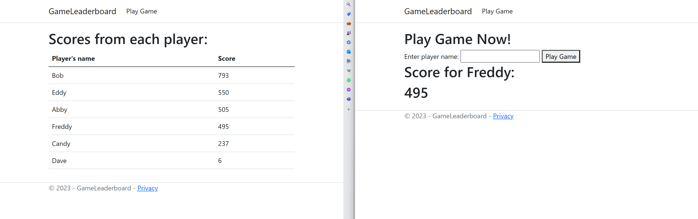

# .NET Leaderboard Web Application using StackExchange.Redis

## Overview
This repository contains sample code for a real-time leaderboard implemented with Redis Cache Sorted Set data structure. It's written in .NET with StackExchange.Redis library. 

Here is an example output for running the application:


## Run the application in Azure

Prerequisites:
- Azure subscription. [Start free](https://azure.microsoft.com/free)
- .NET 8 or above. [Download](https://dotnet.microsoft.com/download/dotnet/8.0)
- Docker. [Get docker](https://docs.docker.com/get-docker/)
- Azure Developer CLI. [Install](https://learn.microsoft.com/azure/developer/azure-developer-cli/install-azd?tabs=winget-windows%2Cbrew-mac%2Cscript-linux&pivots=os-windows)

1. Open a command prompt
2. Change directory to the project folder where azure.yaml file is located
3. Run:
    ```
    azd up
    ```
4. Follow command prompt to enter environment name and select subscription
5. This will create all the resources needed to run the sample:
- Azure Container App instance and environment
- Azure Container Registry
- Azure Cache for Redis
- Azure Key Vault

6. To clean up the environment, run 
    ```
    azd down
    ```
